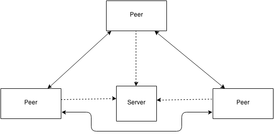

# Epsi I4Grp3 Peer Projet

Our project is able to send message and have a video call with somebody in `peer to peer`.

We use `WebRTC` to use the peer-to-peer power on web navigator. We used PeerServer (built on dokcer machine) to establish connections between to peerjs client. Data is not proxied through the server. We used this server because a small percentage of users are behind symmetric NATs. When two symmetric NAT users try to connect to each other, NAT traversal is impossible and no connection can be made. A workaround is to proxy through the connection through a TURN server.

(Our video call is sometime buggy...)



Each client aims to register itself on the server and use the server as a proxy during the NAT traversal procedures

## Contributors

- Figueiredo Adrien
- Martin Gabriel

## Stack

- React
- Typescript
- PeerJs
- Styled-components (for theming and style)
- Yup (for data validation)
- react-hook-form (formulaire)

## Run

First run docker peer server:

```bash
yarn docker
```

With yarn

```bash
yarn && yarn start
```

or

With npm

```bash
npm install && npm run start
```
